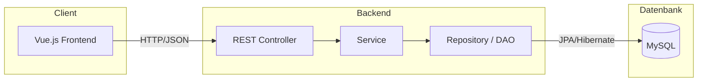

K# SimpleRisk

Einfaches Risikomanagement-Tool – getrenntes Backend (Java) und Frontend (Vue.js), MySQL als Datenbank.

---

## Softwarearchitektur

SimpleRisk ist als **Client-Server-Anwendung** aufgebaut: Ein Vue.js-Frontend spricht per REST-API mit einem Java-Backend; das Backend nutzt eine **3-Layer-Architektur** mit **DAO-Muster** für den Datenzugriff auf MySQL.

### Überblick

| Komponente | Technologie | Rolle |
|------------|-------------|--------|
| **Frontend** | Vue 3, Vite | Single-Page-App, UI, Aufruf der REST-API |
| **Backend** | Spring Boot 3, Java 17 | REST-API, Geschäftslogik, Datenzugriff |
| **Datenbank** | MySQL 8 | Persistenz (lokal oder im Docker-Container) |

### Architekturdiagramm



- **Frontend:** Läuft im Browser (Dev: Vite auf Port 5173), ruft `http://localhost:8080/api/...` auf (per Proxy oder direkt). CORS ist im Backend für die Frontend-Origin freigegeben.
- **Backend:** Spring Boot mit Context-Pfad `/api`. Drei Schichten:
  - **Presentation Layer:** REST-Controller nehmen Requests entgegen, delegieren an Services, liefern JSON.
  - **Business Layer:** Services kapseln Geschäftslogik und Transaktionen, nutzen nur Repositories (DAOs).
  - **Data Access Layer:** Spring-Data-JPA-Repositories (DAO-Muster) kapseln den Zugriff auf MySQL; JPA-Entities bilden die Tabellen ab.

### Projektstruktur (Repository-Ebene)

```
SimpleRisk/
├── backend/          # Spring-Boot-Anwendung (Java 17)
├── frontend/         # Vue-3-Anwendung (Vite)
├── docker/           # Docker Compose für MySQL
└── README.md
```

---

## Backend – 3-Layer und DAO

- **Build:** Maven  
- **Framework:** Spring Boot (Web, Data JPA, Validation)  
- **Datenbankzugriff:** Spring Data JPA, Hibernate, MySQL-Connector  

Struktur unter `backend/src/main/java/com/simplerisk/`:

| Paket | Schicht | Inhalt |
|-------|---------|--------|
| `controller/` | Presentation | REST-Controller (z. B. `RiskController`), URL-Pfad unter `/api` |
| `service/` + `service/impl/` | Business | Interfaces und Implementierungen, `@Transactional`, keine direkte DB-Nutzung |
| `repository/` | Data Access (DAO) | Spring-Data-JPA-Repositories (z. B. `RiskRepository`), kapseln CRUD und Abfragen |
| `entity/` | Data Access | JPA-Entitäten (z. B. `Risk`), Abbildung auf MySQL-Tabellen |
| `config/` | — | CORS, weitere Konfiguration |
| `exception/` | — | Globale Exception-Behandlung (Validierung, Not Found) |

Datenfluss Beispiel: **Risiko abrufen** → Controller → Service → Repository (DAO) → JPA/Hibernate → MySQL → Rückgabe als JSON.

---

## Frontend

- **Framework:** Vue 3 (Composition API mit `<script setup>`)  
- **Build/Dev-Server:** Vite  
- **Kommunikation:** `fetch` an die Backend-API; im Dev-Modus Proxy von `/api` auf `http://localhost:8080` (siehe `frontend/vite.config.js`).  

Relevante Ordner: `frontend/src/` (Einstieg `main.js`, `App.vue`, Komponenten in `components/`).

---

## Datenbank

- **Engine:** MySQL 8  
- **Bereitstellung:** Optional per **Docker** aus dem Ordner `docker/` (empfohlen) oder lokale MySQL-Installation.  
- **Verbindung:** Backend konfiguriert in `backend/src/main/resources/application.yml` (URL, User, Passwort). Datenbankname und User: `simplerisk` / `simplerisk`.

---

## Voraussetzungen

- **Java 17**, **Maven 3.8+**
- **Docker** (für MySQL per Docker Compose) oder **MySQL 8** lokal
- **Node.js 18+** (für das Frontend)

---

## Schnellstart

### 1. Datenbank (Docker)

```bash
cd docker
docker compose up -d
```

MySQL: **localhost:3306**, DB `simplerisk`, User/Passwort `simplerisk`/`simplerisk`. Persistenz über Volume `simplerisk-mysql-data`.

Stoppen: `docker compose down`. Volume löschen: `docker compose down -v`.

**Ohne Docker:** MySQL lokal starten und Datenbank/User manuell anlegen (siehe Abschnitt „Datenbank manuell“).

### 2. Backend

```bash
cd backend
mvn spring-boot:run
```

API: **http://localhost:8080** mit Context-Pfad `/api` (z. B. http://localhost:8080/api/risks).

### 3. Frontend

```bash
cd frontend
npm install
npm run dev
```

App: **http://localhost:5173**. API-Aufrufe gehen per Proxy an das Backend.

---

## Datenbank manuell (ohne Docker)

```sql
CREATE DATABASE simplerisk CHARACTER SET utf8mb4 COLLATE utf8mb4_unicode_ci;
CREATE USER 'simplerisk'@'localhost' IDENTIFIED BY 'simplerisk';
GRANT ALL PRIVILEGES ON simplerisk.* TO 'simplerisk'@'localhost';
FLUSH PRIVILEGES;
```

Falls nötig: Zugangsdaten in `backend/src/main/resources/application.yml` anpassen.

---

## API (Risiken)

| Methode | URL | Beschreibung |
|---------|-----|--------------|
| GET | `/api/risks` | Alle Risiken |
| GET | `/api/risks/{id}` | Ein Risiko |
| GET | `/api/risks?status=OPEN` | Nach Status filtern |
| POST | `/api/risks` | Risiko anlegen (JSON: `title`, optional `description`, `status`) |
| PUT | `/api/risks/{id}` | Risiko aktualisieren |
| DELETE | `/api/risks/{id}` | Risiko löschen |
